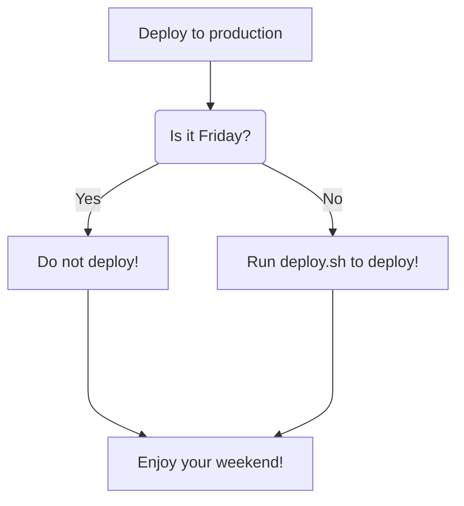

# elm-debt-calculator
Program to calculate an optimal payment plan for numerous loans

# building
`.build.ps1`
or
`elm make .\src\Main.elm --optimize --output .\js\main.js`

# testing
`elm-test`

```mermaid
flowchart TD
    A[Deploy to production] --> B(Is it Friday?);
    B -- Yes --> C[Do not deploy!];
    B -- No --> D[Run deploy.sh to deploy!];
    C ----> E[Enjoy your weekend!];
    D ----> E[Enjoy your weekend!];
```
